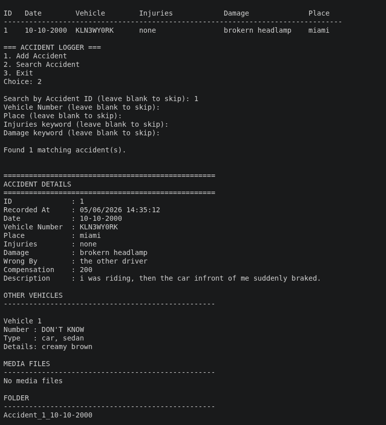

# Accident Logger

A Python desktop application for recording and managing accident reports. The application stores accident data in JSON format and automatically organizes records in a dedicated Accident directory.

## Features

* Create and save accident reports
* Store accident data in JSON format
* Automatically organize records in an `Accident` folder
* Generate unique accident IDs
* Simple and lightweight interface
* Local data storage (no internet connection required)

## Screenshot



## Technologies Used

* Python
* Tkinter
* JSON
* File System Operations

## Installation

### Clone the Repository

```bash
git clone https://github.com/MMRiyas/python-accident-logger.git
```

### Navigate to the Project Directory

```bash
cd python-accident-logger
```

### Run the Application

```bash
python accident_logger.py
```

## Project Structure

```text
python-accident-logger/
├── Accident/
│   ├── accidents.json
│   └── accident_001/
├── screenshots/
│   └── image.png
├── accident_logger.py
├── LICENSE
├── README.md
└── .gitignore
```

## Usage

1. Launch the application.
2. Select or create the Accident data directory.
3. Enter accident details.
4. Save the report.
5. View stored records in the Accident folder.

## Future Improvements

* Search accident records
* Export reports to PDF
* Image attachments
* Database support
* Cloud synchronization
* Statistics dashboard

## Contributing

Contributions, suggestions, and bug reports are welcome.

1. Fork the repository
2. Create a feature branch
3. Commit your changes
4. Open a Pull Request

## License

This project is licensed under the MIT License. See the LICENSE file for details.

## Author

**MM Riyas**
